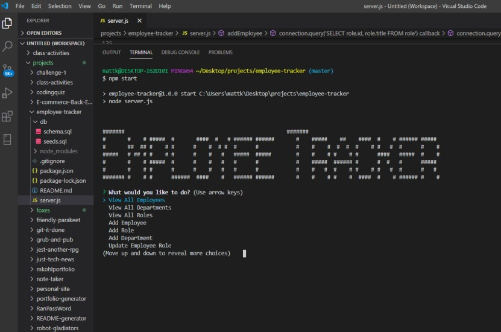
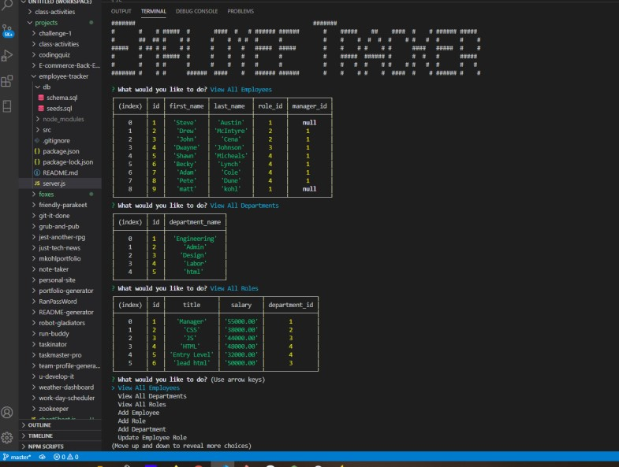

<h1 align="center">Employee Tracker</h1>

<p align="center">


</p>

<p align="center">

</p>


## Table of Contents
- [Description](#description)
- [Installation](#install)
- [Usage](#usage)
- [Questions](#questions)

## Description
### A node.js application that an employer can use to track employees info in a database.

## Install
```
npm init

npm install inquirer

npm install mysql2

npm install console-table

```
## Usage
### In the terminal Run  
```
npm start
```
### To begin the application   
  
## Below is a link to the GitHub repository   
[Employee Tracker](https://github.com/mattkohl82/employee-tracker)    

### Below is a link to a demostration of the application 
[Demo of application](https://youtu.be/imfbhUPn5Q0) 
  

### Screen shot of tables in the application

   

## Questions
### [Mattkohl82 for GitHub](https://github.com/Mattkohl82)  
### mattkohl82@gmail.com for ✉️ email 